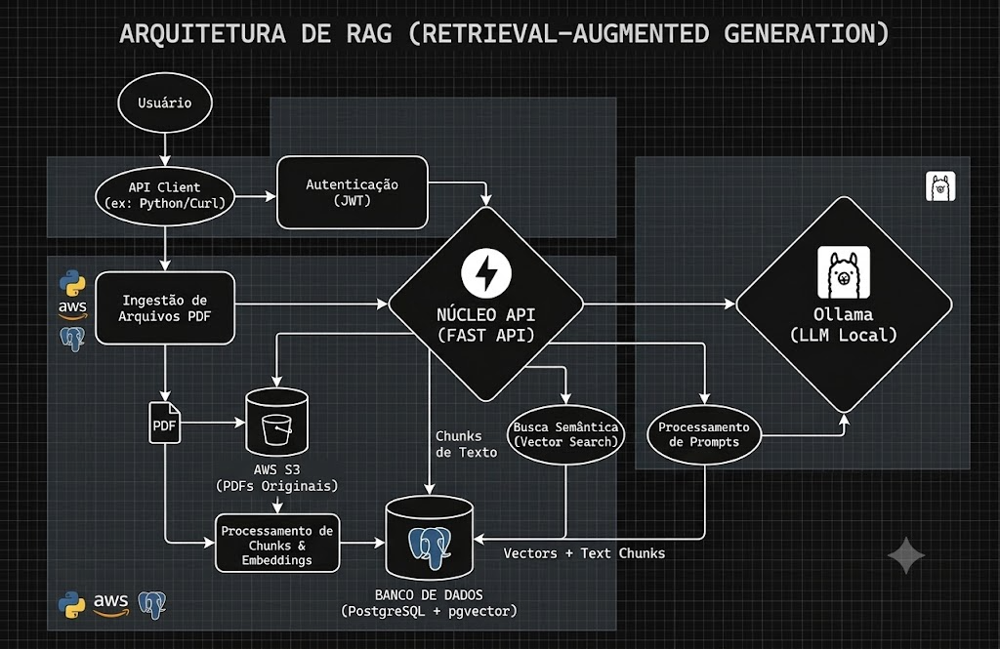

# IA Assistant - API RAG para estudo

Este é um projeto prático para construir um assistente inteligente baseado em recuperação de informação (RAG). A ideia principal é permitir que um usuário faça upload de documentos em PDF, extraia o conteúdo, transforme esse conteúdo em embeddings e, em seguida, faça perguntas sobre os arquivos com base no contexto recuperado.

O projeto é uma boa base para aprender conceitos de:

- APIs com FastAPI
- Integração com bancos de dados relacionais e vetoriais
- Armazenamento de arquivos com MinIO/S3
- Geração de embeddings e busca semântica
- Uso de modelos LLM locais com Ollama
- Arquitetura RAG em um contexto prático

---

## Objetivo do projeto

O projeto serve como uma prova de conceito para criar um assistente que responde perguntas usando documentos carregados pelo usuário. Em vez de depender apenas do conhecimento interno do modelo, o sistema recupera trechos relevantes dos arquivos enviados e usa esses trechos como contexto para a resposta.

Esse tipo de arquitetura é muito comum em aplicações de:

- busca de conhecimento sobre documentos
- assistentes para bases internas
- chatbots com contexto próprio
- projetos acadêmicos e de estudo em IA

---

## Como o projeto funciona

O fluxo básico é o seguinte:

1. Um usuário é criado no sistema.
2. O usuário envia um arquivo PDF para a API.
3. O arquivo é armazenado em um bucket do MinIO, que funciona de forma semelhante a um serviço S3.
4. O sistema lê o PDF e divide o texto em chunks menores.
5. Cada chunk é convertido em um embedding.
6. Os embeddings são salvos em um banco PostgreSQL com a extensão pgvector.
7. Quando o usuário faz uma pergunta, o sistema busca os chunks mais semelhantes à pergunta.
8. Esses chunks são enviados ao modelo LLM para gerar uma resposta grounded no conteúdo recuperado.

---

## Arquitetura geral

O projeto é composto por uma API FastAPI e por uma série de serviços organizados em módulos:

- [src/main.py](src/main.py): ponto de entrada da aplicação e definição das rotas.
- [src/services/auth.py](src/services/auth.py): cadastro, autenticação e login de usuários.
- [src/services/carrega_arquivos.py](src/services/carrega_arquivos.py): upload e recebimento dos arquivos.
- [src/services/vetorizacao.py](src/services/vetorizacao.py): leitura dos PDFs, criação de chunks, embeddings e armazenamento.
- [src/services/perguntas.py](src/services/perguntas.py): busca de contexto e geração da resposta via LLM.
- [src/services/database.py](src/services/database.py): configuração da conexão com o PostgreSQL.
- [src/services/models.py](src/services/models.py): modelos SQLAlchemy para usuários, documentos e chunks.
- [src/services/s3_connection.py](src/services/s3_connection.py): conexão com o MinIO/S3.

---

## Tecnologias utilizadas

- Python 3.10+
- FastAPI
- SQLAlchemy
- PostgreSQL + pgvector
- MinIO
- LangChain
- Ollama
- Passlib + bcrypt
- pypdf

---

## O que precisa para funcionar

### 1. Dependências do ambiente

É necessário ter instalado:

- Python 3.10 ou superior
- Docker e Docker Compose
- Ollama com os modelos necessários

### 2. Modelos locais do Ollama

O projeto utiliza os modelos:

- nomic-embed-text: para gerar embeddings
- llama3: para responder perguntas

Se o Ollama não estiver instalado ou os modelos não estiverem disponíveis, a aplicação não funcionará corretamente.

### 3. Serviços externos

O projeto depende de:

- PostgreSQL com extensão pgvector
- MinIO (ou um endpoint S3 compatível)

Esses serviços podem ser iniciados com Docker Compose usando o arquivo [docker-compose.yaml](docker-compose.yaml).

### 4. Variáveis de ambiente

O projeto lê variáveis de ambiente para conectar com o MinIO e com os serviços de banco. Um arquivo .env deve ser criado com valores como:

```env
MINIO_ROOT_USER=minioadmin
MINIO_ROOT_PASSWORD=minioadmin
POSTGRES_USER=admin
POSTGRES_PASSWORD=admin123456
POSTGRES_DB=rag_db
PGADMIN_DEFAULT_EMAIL=admin@example.com
PGADMIN_DEFAULT_PASSWORD=admin123456
S3_ENDPOINT_URL=http://localhost:9222
AWS_ACCESS_KEY_ID=minioadmin
AWS_SECRET_ACCESS_KEY=minioadmin
```

> Observação: o projeto ainda usa alguns valores fixos em código, então ele funciona melhor como projeto de estudo e pode exigir ajustes para uso mais robusto.

---

## Como executar o projeto

### 1. Subir os serviços com Docker

```bash
docker compose up -d
```

Isso sobe:

- PostgreSQL
- MinIO
- pgAdmin

### 2. Instalar as dependências

```bash
uv sync
```

Ou, se preferir usar pip:

```bash
pip install -r requirements.txt
```

> Como o projeto usa o arquivo [pyproject.toml](pyproject.toml), a abordagem recomendada é usar o ambiente gerenciado pelo uv.

### 3. Criar o banco de dados

A API expõe um endpoint para criar as tabelas:

```bash
curl -X POST http://localhost:8000/cria_database
```

### 4. Iniciar a API

```bash
cd src
uv run uvicorn main:app --reload --host 0.0.0.0 --port 8000
```

---

## Endpoints principais

A API possui rotas principais para o fluxo do sistema:

### Usuários

- POST /criar_usuario
- POST /autenticar_usuario
- POST /login

### Documentos e indexação

- POST /carrega_arquivos
- POST /treinamento_modelo

### Perguntas

- POST /prompt

### Exemplo de uso

Criar usuário:

```bash
curl -X POST "http://localhost:8000/criar_usuario?username=estudo&email=estudo@example.com&password=123456"
```

Enviar um PDF:

```bash
curl -X POST "http://localhost:8000/carrega_arquivos?email=estudo@example.com" \
  -F "arquivo=@/caminho/para/documento.pdf"
```

Treinar a base de documentos:

```bash
curl -X POST "http://localhost:8000/treinamento_modelo?email=estudo@example.com"
```

Fazer uma pergunta:

```bash
curl -X POST "http://localhost:8000/prompt?pergunta=Qual%20%C3%A9%20o%20tema%20do%20documento&email=estudo@example.com"
```

---

## Fluxo de dados em resumo

O fluxo do projeto pode ser resumido assim:

```text
Usuário -> API -> MinIO -> Processamento -> PostgreSQL + pgvector -> LLM -> Resposta
```

## Arquitetura do projeto


Esse desenho mostra a integração entre armazenamento, recuperação e geração de resposta.

---

## Pontos fortes do projeto

- Demonstra de forma prática o conceito de RAG
- Mostra integração entre múltiplos serviços
- Permite evoluir para uma solução mais robusta

---

## Possíveis melhorias

Como este é um projeto de estudo, ainda existem várias oportunidades de evolução:

1. Melhorar a segurança
   - adicionar autenticação JWT
   - proteger melhor as rotas
   - remover exposição de dados sensíveis

2. Tornar a configuração mais profissional
   - mover valores fixos para variáveis de ambiente
   - centralizar configurações em um módulo dedicado

3. Melhorar a experiência de uso
   - adicionar uma interface web ou frontend simples
   - permitir upload de vários arquivos de uma vez
   - suportar outros formatos além de PDF

4. Melhorar a robustez
   - adicionar testes automatizados
   - implementar filas de processamento assíncrono
   - tratar erros de forma mais elegante

5. Melhorar a qualidade da busca
   - ajustar o tamanho dos chunks
   - experimentar outros modelos de embedding
   - testar diferentes estratégias de recuperação

6. Melhorar observabilidade
   - logs estruturados
   - métricas de uso
   - rastreamento de erros e latência